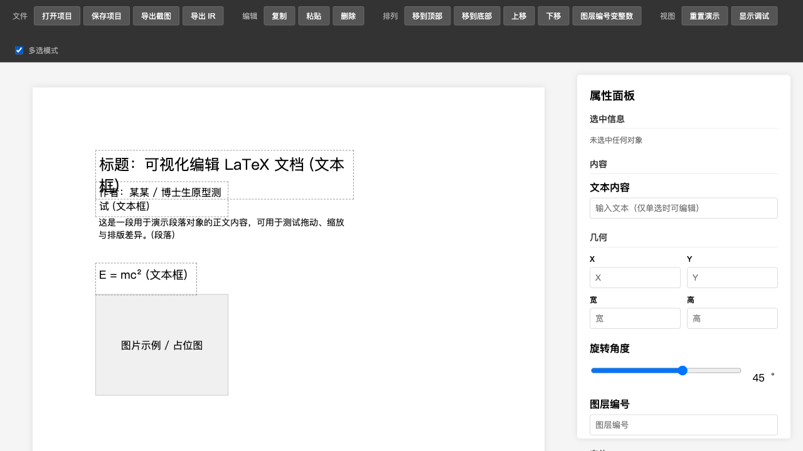
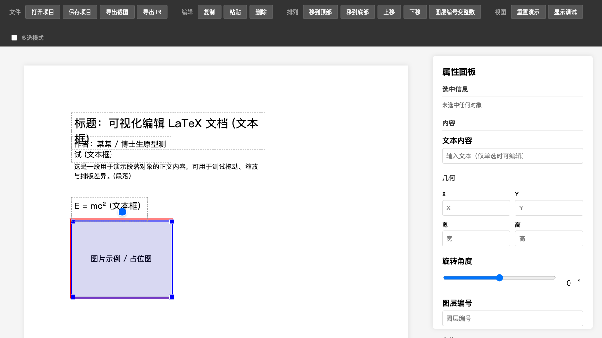

# guiLaTeX

**可视化 LaTeX 编辑器** — 支持 PDF 元素级编辑，通过 Export IR 中间层生成 LaTeX 代码，提供 Web + Qt 双端原型。

> 🏆 [TRAE 创意编程大赛参赛作品](https://forum.trae.cn/t/topic/7939/12) · 欢迎投票加油 ❤️

---

## 界面预览

<table>
<tr>
<td width="50%">

### 🌐 Web 端

纯浏览器应用，零依赖，直接打开即用。

<br>


<br>



</td>
<td width="50%">

### 🖥️ Qt 桌面端

PyQt6 桌面应用，roundtrip 闭环已跑通。

<br>


<br>



</td>
</tr>
</table>

---

## 当前状态

> ⚠️ **这不是最终完整版。** v1-candidate · 第一阶段收官区

| | Web | Qt | Core |
|---|---|---|---|
| **状态** | 独立应用候选版 | v1-candidate | 已封板 |
| **验证层级** | 浏览器级 | 桌面级 | 脚本级 |
| **核心能力** | 文本 CRUD、多选旋转、图层管理、IR/PDF 导出、项目保存/打开 | 元素编辑、旋转、复制粘贴、LaTeX 导入导出、roundtrip 闭环 | IR Schema + LaTeX 导出器 + 回归样本 |
| **已知限制** | LaTeX 依赖 Python bridge | font_family Core gap、PDF 主路径 blocked | 字体映射硬编码 |

→ 详细状态：[公开总览](docs/release/public_project_overview.md)

---

## 🎭 开发展示

本项目采用 AI Agent 协作开发，保留了完整的开发过程记录：

- 📜 [朝堂风云录 · 开发展示页](https://samzebrado.github.io/guiLaTeX/showcase/) — 宫廷风全记录
- 📋 [Demo 入口](https://samzebrado.github.io/guiLaTeX/showcase/demo_index.html) — 模块状态 + 导航

---

## 文档

<details>
<summary><b>📋 发布文档</b></summary>

- [公开总览](docs/release/public_project_overview.md) — 项目状态、证据层级、红线清单
- [演示资产索引](docs/release/demo_asset_index.md) — 全部演示资产清单
- [总录制脚本](docs/release/demo_master_shot_list.md) — 建议的演示录制流程
- [论坛战报草稿](docs/release/forum_update_draft.md) — 可直接发布的更新贴

</details>

<details>
<summary><b>📖 技术文档</b></summary>

- [架构设计](docs/architecture.md) · [用户指南](docs/user-guide.md)
- [Export Core 设计](docs/export_core_design.md) · [快速上手](docs/export_core_quickstart.md)
- [Conforming LaTeX Profile](docs/export_core_conforming_latex_profile.md) · [Roundtrip 指南](docs/export_core_roundtrip_guide.md)
- [给人类读者的阅读说明](docs/README_FOR_HUMANS.md)

</details>

---

## 项目结构

```
guiLaTeX/
├── src/                    # 核心源代码
├── export_core/            # Export IR 中间层
├── web_prototype/          # Web 端（纯浏览器应用）
├── tests/                  # 测试套件
├── showcase/               # 开发展示页
├── docs/                   # 文档
└── assets/                 # 截图
```

## 技术栈

Python 3.10+ · PyQt6 · PyMuPDF · HTML/CSS/JS · LaTeX · Playwright

## 许可

[Apache License 2.0](LICENSE)

---

# English

## guiLaTeX

**A visual LaTeX editor** — supports element-level PDF editing, LaTeX code generation via Export IR, and dual-end prototypes (Web + Qt).

> 🏆 [TRAE Creative Coding Contest Submission](https://forum.trae.cn/t/topic/7939/12) · Vote for us! ❤️

---

## Screenshots

<table>
<tr>
<td width="50%">

### 🌐 Web

A pure browser application, zero dependencies.

<br>


<br>


</td>
<td width="50%">

### 🖥️ Qt Desktop

A PyQt6 desktop app with roundtrip verification.

<br>


<br>


</td>
</tr>
</table>

---

## Current Status

> ⚠️ **This is not the final version.** v1-candidate · Phase 1 milestone

| | Web | Qt | Core |
|---|---|---|---|
| **Status** | Independent app candidate | v1-candidate | Sealed |
| **Verification** | Browser-level | Desktop-level | Script-level |
| **Capabilities** | Text CRUD, multi-select rotation, layer management, IR/PDF export, project save/open | Element editing, rotation, copy/paste, LaTeX import/export, roundtrip | IR Schema + LaTeX exporter + regression samples |
| **Known Limits** | LaTeX depends on Python bridge | font_family Core gap, PDF path blocked | Font mapping hardcoded |

→ Full details: [Public Overview](docs/release/public_project_overview.md)

---

## 🎭 Development Showcase

This project uses AI agent collaborative development with full process records preserved:

- 📜 [Court Chronicles · Showcase](https://samzebrado.github.io/guiLaTeX/showcase/) — Imperial court themed dev journal
- 📋 [Demo Index](https://samzebrado.github.io/guiLaTeX/showcase/demo_index.html) — Module status + navigation

---

## Documentation

<details>
<summary><b>📋 Release Documents</b></summary>

- [Public Overview](docs/release/public_project_overview.md) — Project status, evidence levels, red lines
- [Demo Asset Index](docs/release/demo_asset_index.md) — Complete demo asset catalog
- [Master Shot List](docs/release/demo_master_shot_list.md) — Suggested demo recording flow
- [Forum Update Draft](docs/release/forum_update_draft.md) — Ready-to-post progress update

</details>

<details>
<summary><b>📖 Technical Docs</b></summary>

- [Architecture](docs/architecture.md) · [User Guide](docs/user-guide.md)
- [Export Core Design](docs/export_core_design.md) · [Quick Start](docs/export_core_quickstart.md)
- [Conforming LaTeX Profile](docs/export_core_conforming_latex_profile.md) · [Roundtrip Guide](docs/export_core_roundtrip_guide.md)
- [README for Humans](docs/README_FOR_HUMANS.md)

</details>

---

## Project Structure

```
guiLaTeX/
├── src/                    # Core source code
├── export_core/            # Export IR intermediate layer
├── web_prototype/          # Web prototype (pure browser app)
├── tests/                  # Test suite
├── showcase/               # Dev showcase pages
├── docs/                   # Documentation
└── assets/                 # Screenshots
```

## Tech Stack

Python 3.10+ · PyQt6 · PyMuPDF · HTML/CSS/JS · LaTeX · Playwright

## License

[Apache License 2.0](LICENSE)
