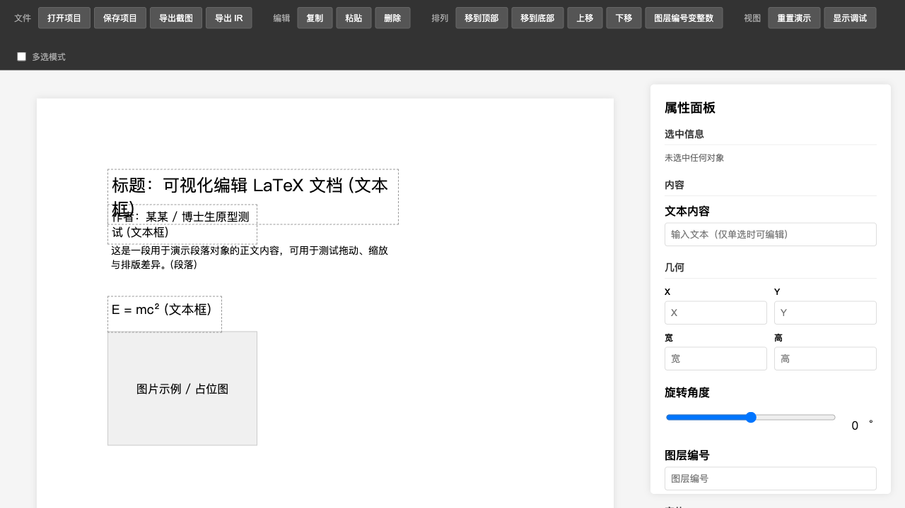
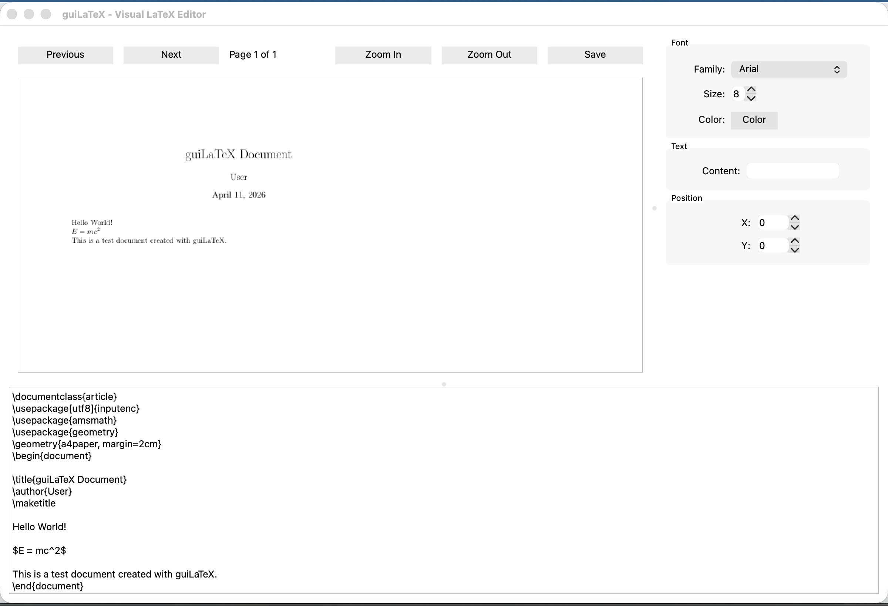

# guiLaTeX

**可视化 LaTeX 编辑器** — 支持 PDF 元素级编辑，通过 Export IR 中间层生成 LaTeX 代码，提供 Web + Qt 双端原型。

> 🏆 [TRAE 创意编程大赛参赛作品](https://forum.trae.cn/t/topic/7939/12) · 欢迎投票加油 ❤️

---

## 界面预览

<table>
<tr>
<td width="50%">

### 🌐 Web 端

纯浏览器应用，零依赖，直接打开即用。

 

 

<!-- GIF 预留：Web 端操作演示 -->
<!--  -->

</td>
<td width="50%">

### 🖥️ Qt 桌面端

PyQt6 桌面应用，roundtrip 闭环已跑通。

 

 

<!-- GIF 预留：Qt 端操作演示 -->
<!--  -->

</td>
</tr>
</table>

---

## 当前状态

> ⚠️ **这不是最终完整版。** v1-candidate · 第一阶段收官区

- 🌐 **Web** — 独立应用候选版，浏览器级验证。文本 CRUD、多选旋转、图层管理、IR/PDF 导出。LaTeX 功能依赖 Python bridge。
- 🖥️ **Qt** — v1-candidate，桌面级验证。Roundtrip 闭环已跑通。已知 font_family Core gap，PDF 主路径尚未实现。
- 📦 **Core** — 已封板。IR Schema + LaTeX 导出器 + 回归样本齐备，Qt 和 Web 均可接入。

---

## 快速体验

- 📜 [朝堂风云录 · 开发展示页](https://samzebrado.github.io/guiLaTeX/showcase/) — AI Agent 协作开发全记录
- 📋 [Demo 入口](https://samzebrado.github.io/guiLaTeX/showcase/demo_index.html) — 模块状态与演示导航
- 🌐 [Web 端在线体验](web_prototype/index.html) — 直接在浏览器中打开

---

## 技术栈

Python 3.10+ · PyQt6 · PyMuPDF · HTML/CSS/JS · LaTeX · Playwright

## 许可

[Apache License 2.0](LICENSE)

---

📖 更多文档

**技术文档**

- [架构设计](docs/architecture.md) · [用户指南](docs/user-guide.md)
- [Export Core 设计](docs/export_core_design.md) · [快速上手](docs/export_core_quickstart.md)
- [Conforming LaTeX Profile](docs/export_core_conforming_latex_profile.md) · [Roundtrip 指南](docs/export_core_roundtrip_guide.md)

**发布材料**

- [公开总览](docs/release/public_project_overview.md) — 项目状态、证据层级、红线清单
- [演示资产索引](docs/release/demo_asset_index.md) · [总录制脚本](docs/release/demo_master_shot_list.md)

---

# English

## guiLaTeX

**A visual LaTeX editor** — supports element-level PDF editing, LaTeX code generation via Export IR, and dual-end prototypes (Web + Qt).

> 🏆 [TRAE Creative Coding Contest Submission](https://forum.trae.cn/t/topic/7939/12) · Vote for us! ❤️

---

## Screenshots

<table>
<tr>
<td width="50%">

### 🌐 Web

A pure browser application, zero dependencies.

 

 

<!-- GIF placeholder: Web demo -->
<!--  -->

</td>
<td width="50%">

### 🖥️ Qt Desktop

A PyQt6 desktop app with roundtrip verification.

 

 

<!-- GIF placeholder: Qt demo -->
<!--  -->

</td>
</tr>
</table>

---

## Current Status

> ⚠️ **This is not the final version.** v1-candidate · Phase 1 milestone

- 🌐 **Web** — Independent app candidate, browser-level verified. Text CRUD, multi-select rotation, layer management, IR/PDF export. LaTeX depends on Python bridge.
- 🖥️ **Qt** — v1-candidate, desktop-level verified. Roundtrip closed loop validated. Known font_family Core gap; PDF path not yet implemented.
- 📦 **Core** — Sealed. IR Schema + LaTeX exporter + regression samples ready. Both Qt and Web can integrate.

---

## Quick Start

- 📜 [Court Chronicles · Showcase](https://samzebrado.github.io/guiLaTeX/showcase/) — AI agent dev journal
- 📋 [Demo Index](https://samzebrado.github.io/guiLaTeX/showcase/demo_index.html) — Module status & demo navigation
- 🌐 [Try Web App](web_prototype/index.html) — Open directly in your browser

---

## Tech Stack

Python 3.10+ · PyQt6 · PyMuPDF · HTML/CSS/JS · LaTeX · Playwright

## License

[Apache License 2.0](LICENSE)

---

📖 More Documentation

**Technical Docs**

- [Architecture](docs/architecture.md) · [User Guide](docs/user-guide.md)
- [Export Core Design](docs/export_core_design.md) · [Quick Start](docs/export_core_quickstart.md)
- [Conforming LaTeX Profile](docs/export_core_conforming_latex_profile.md) · [Roundtrip Guide](docs/export_core_roundtrip_guide.md)

**Release Materials**

- [Public Overview](docs/release/public_project_overview.md) — Status, evidence levels, red lines
- [Demo Asset Index](docs/release/demo_asset_index.md) · [Master Shot List](docs/release/demo_master_shot_list.md)

